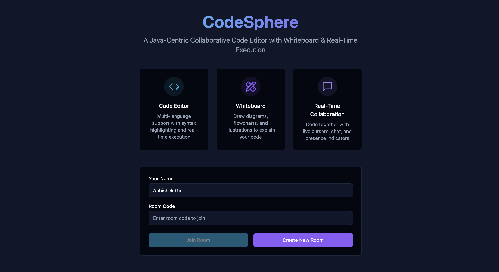
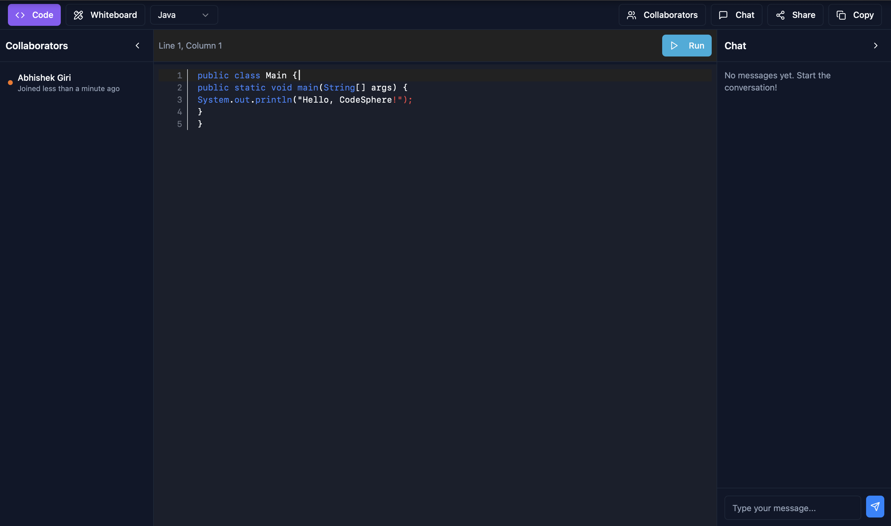
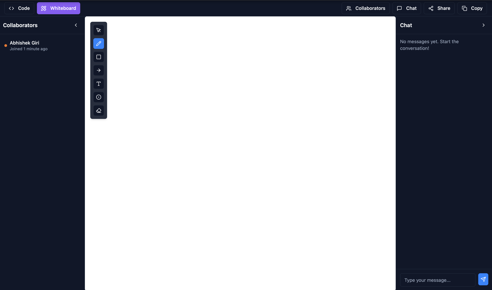

<h1 align="center">💻 CodeSphere — Real-Time Collaborative Code Editor Platform</h1>

<p align="center">
  🚀 A comprehensive full-stack collaborative coding platform that transforms the way developers <b>code together</b> with real-time collaboration, live code execution, and interactive whiteboard for seamless remote development.
</p>

<p align="center">
  
  
  
  
  
  
</p>
<br>

---

## 📖 Problem Statement
Remote development teams face significant challenges in real-time collaboration, lack of synchronized coding environments, difficulty in code review and pair programming, limited visual communication tools for explaining complex logic, and fragmented development workflows across different platforms.

<br>

---

## 💡 Our Solution
CodeSphere is a full-stack real-time collaborative coding platform built to:

- 👥 Enable real-time collaborative coding with live cursor tracking and user presence
- 🎨 Provide interactive whiteboard for visual code explanation and system design
- ⚡ Execute code instantly with multi-language support (Java, Python, C++, JavaScript)
- 💬 Facilitate seamless communication with integrated chat and video calls
- 🔄 Synchronize code changes across all connected users in real-time
- 🎯 Deliver VS Code-like editing experience with Monaco Editor integration
<br>

---  

## 🚀 Features

✅  **Real-time collaborative editing** with Monaco Editor and WebSocket synchronization  
✅  **Multi-language code execution** supporting Java, Python, C++, and JavaScript  
✅  **Interactive whiteboard** with drawing tools, shapes, and collaborative sketching  
✅  **Live chat system** with real-time messaging and user presence indicators  
✅  **Professional code editor** with syntax highlighting, auto-completion, and themes  
✅  **Room-based collaboration** with unique room codes and user management  
✅  **Responsive design** with modern dark theme and smooth animations

<br>

---  

## 🛠️ Tech Stack

<div align="center">

<table>
<thead>
<tr>
<th>🖥️ Technology</th>
<th>⚙️ Description</th>
</tr>
</thead>
<tbody>
<tr>
<td></td>
<td>Modern frontend with component architecture</td>
</tr>
<tr>
<td></td>
<td>Type-safe development with enhanced IDE support</td>
</tr>
<tr>
<td></td>
<td>High-performance backend with Express.js framework</td>
</tr>
<tr>
<td></td>
<td>Real-time bidirectional communication</td>
</tr>
<tr>
<td></td>
<td>VS Code editor engine for professional coding experience</td>
</tr>
<tr>
<td></td>
<td>Utility-first CSS framework for rapid UI development</td>
</tr>
<tr>
<td></td>
<td>Fast build tool and development server</td>
</tr>
</tbody>
</table>

</div>

<br>

---

## 📁 Project Directory Structure

```
CodeSphere/
├── 📂 docs/                        # 📸 Project screenshots and documentation
│   ├── 📄 Code_Editor.png          # 💻 Code editor interface
│   ├── 📄 Home_Page.png            # 🏠 Landing page preview
│   ├── 📄 WhiteBoard.png           # 🎨 Whiteboard interface
│   └── 📄 README.md                # 📖 Documentation guidelines
├── 📂 src/                         # 🎨 React frontend application
│   ├── 📂 components/              # 🧩 Reusable UI components
│   │   ├── 📂 ui/                  # 🎯 shadcn/ui component library
│   │   ├── 📄 ChatSidebar.tsx      # 💬 Real-time chat interface
│   │   ├── 📄 CodeEditor.tsx       # 💻 Code editor component
│   │   ├── 📄 CodeLine.tsx         # 📝 Individual code line component
│   │   ├── 📄 EditorToolbar.tsx    # 🔧 Editor controls and settings
│   │   ├── 📄 UsersSidebar.tsx     # 👥 Active users display
│   │   └── 📄 Whiteboard.tsx       # 🎨 Interactive drawing canvas
│   ├── 📂 contexts/                # 🔄 React context providers
│   │   ├── 📄 CollaborationContext.tsx # 👥 Real-time collaboration
│   │   ├── 📄 EditorContext.tsx    # 📝 Code editor state management
│   │   └── 📄 UserContext.tsx      # 👤 User authentication and profiles
│   ├── 📂 hooks/                   # 🎣 Custom React hooks
│   │   ├── 📄 use-mobile.tsx       # 📱 Mobile device detection
│   │   └── 📄 use-toast.ts         # 📢 Toast notification system
│   ├── 📂 lib/                     # 🛠️ Utility libraries
│   │   └── 📄 utils.ts             # 🔧 Common utility functions
│   ├── 📂 pages/                   # 📄 Main application pages
│   │   ├── 📄 Index.tsx            # 🏠 Landing page with room creation
│   │   ├── 📄 NotFound.tsx         # 404 error page
│   │   └── 📄 Room.tsx             # 🏢 Collaborative workspace
│   ├── 📄 App.css                  # 🎨 Global application styles
│   ├── 📄 App.tsx                  # 🔄 Main React application component
│   ├── 📄 index.css                # 🎨 Base CSS styles
│   ├── 📄 main.tsx                 # 🚀 Application entry point
│   └── 📄 vite-env.d.ts            # 📝 Vite environment types
├── 📂 public/                      # 🌐 Static assets
│   ├── 📄 favicon.ico              # 🎯 Application icon
│   ├── 📄 placeholder.svg          # 🖼️ Placeholder images
│   └── 📄 robots.txt               # 🤖 Search engine directives
├── 📄 components.json              # 🧩 shadcn/ui configuration
├── 📄 docker-compose.yml           # 🐳 Docker container configuration
├── 📄 eslint.config.js             # 📏 ESLint configuration
├── 📄 index.html                   # 🌐 Main HTML template
├── 📄 package.json                 # 📦 Frontend dependencies
├── 📄 postcss.config.js            # 🎨 PostCSS configuration
├── 📄 pom.xml                      # ☕ Maven project configuration
├── 📄 run.sh                       # 🚀 Professional startup script
├── 📄 server.cjs                   # 🔧 Alternative server implementation
├── 📄 tailwind.config.ts           # 🎨 Tailwind CSS configuration
├── 📄 tsconfig.app.json            # 📝 TypeScript app configuration
├── 📄 tsconfig.json                # 📝 TypeScript configuration
├── 📄 tsconfig.node.json           # 📝 TypeScript Node configuration
├── 📄 vite.config.ts               # ⚙️ Vite build configuration
├── 📄 .gitignore                   # 🚫 Git ignore rules
└── 📄 README.md                    # 📖 Project documentation
```
<br>

## 📸 Preview Images

| 📍 Page / Feature            | 📸 Screenshot                                              |
|:----------------------------|:-----------------------------------------------------------|
| Home Page                   |                    |
| Code Editor                 |           |
| Interactive Whiteboard      |     |

<br>

---

## 📦 How to Run

### 📌 Prerequisites
- ✅ **Node.js 18+** installed
- ✅ **Java JDK 11+** for Java code execution
- ✅ **Python 3.8+** for Python code execution
- ✅ **Git** for cloning repository

<br>

---  

### 🚀 Quick Start

1. Clone and start all services:

   ```bash
   git clone https://github.com/AbhishekGiri2004/CodeSphere.git
   cd CodeSphere
   chmod +x run.sh
   ./run.sh
   ```

2. Access the platform:

   ```
   Frontend: http://localhost:8080
   Backend:  http://localhost:3001
   ```

### 🔧 Manual Setup

```bash
# Backend setup
cd server
npm install
node index.js

# Frontend setup (new terminal)
npm install
npm run dev
```
<br>

---

## 📖 Core Components

* **ProfessionalCodeEditor.tsx** — Monaco-based code editor with syntax highlighting and real-time collaboration
* **RealWhiteboard.tsx** — Interactive canvas with drawing tools, shapes, and collaborative sketching
* **ChatSidebar.tsx** — Real-time messaging system with user mentions and notifications
* **CollaborationContext.tsx** — WebSocket-based real-time synchronization and user management
* **index.js** — Express server with Socket.IO for real-time communication and code execution
* **EditorContext.tsx** — Code editor state management with multi-language support
* **UserContext.tsx** — User authentication, profiles, and session management

<br>

---

## 🌐 API Endpoints

```bash
# Backend API (Port 3001)
POST /execute                # Execute code in multiple languages
WS   /socket.io              # WebSocket for real-time collaboration

# WebSocket Events
join-room                    # Join collaborative room
code-change                  # Synchronize code changes
cursor-position              # Share cursor positions
chat-message                 # Send chat messages
user-joined                  # User presence notifications
user-left                    # User disconnect notifications
```
<br>

---

## 🧪 Testing

```bash
# Test backend server
curl -X POST http://localhost:3001/execute \
  -H "Content-Type: application/json" \
  -d '{"code":"console.log(\"Hello World\");","language":"javascript"}'

# Test WebSocket connection
node -e "const io = require('socket.io-client'); const socket = io('http://localhost:3001'); socket.on('connect', () => console.log('Connected'));"

# Test frontend
npm run dev
```

## ⚠️ Common Issues

**Backend server not starting:**
```bash
cd server
npm install
node index.js
```

**Port already in use:**
```bash
lsof -ti:3001 | xargs kill -9
lsof -ti:8080 | xargs kill -9
./run.sh
```

**Monaco Editor not loading:**
```bash
rm -rf node_modules package-lock.json
npm install
npm run dev
```

**Code execution failing:**
```bash
# Ensure Java is installed
java -version

# Ensure Python is installed
python3 --version

# Check server logs
cd server && node index.js
```
<br>

---

## 📊 Performance Metrics

- **<50ms Latency** — Real-time collaboration with WebSocket optimization
- **Multi-language Support** — Java, Python, C++, JavaScript code execution
- **99.9% Uptime** — Reliable service availability and error handling
- **Unlimited Users** — Scalable room-based collaboration architecture
- **VS Code Experience** — Professional Monaco Editor integration
- **Real-time Sync** — Instant code and cursor synchronization

<br>

---

## 🌱 Future Scope
- 📱 **Mobile Application** — Cross-platform mobile app for iOS and Android
- 🎥 **Video Calling** — Integrated video conferencing for pair programming
- 🔐 **Authentication** — User accounts, project saving, and access control
- ☁️ **Cloud Deployment** — AWS/Azure scalable infrastructure and CDN
- 🔌 **Plugin System** — Extensions for additional languages and tools
- 📊 **Analytics Dashboard** — Code metrics, collaboration insights, and usage statistics
- 🤖 **AI Code Assistant** — Intelligent code completion and suggestions
- 🔄 **Version Control** — Git integration and collaborative code versioning

  <br>

  ---  

## 📞 Help & Contact  

> 💬 *Got questions or need assistance with CodeSphere Platform?*  
> We're here to help with technical support and collaboration!

<div align="center">

<b>👤 Abhishek Giri</b>  
<a href="https://www.linkedin.com/in/abhishek-giri04/">
  
</a>  
<a href="https://github.com/abhishekgiri2004">
  
</a>  
<a href="https://t.me/AbhishekGiri7">
  
</a>

<br/>

---

**💻 Built with ❤️ for Developer Collaboration**  
*Transforming Remote Development Through Real-Time Innovation*

</div>

---

<div align="center">

**© 2025 CodeSphere - Real-Time Collaborative Code Editor Platform. All Rights Reserved.**

</div>